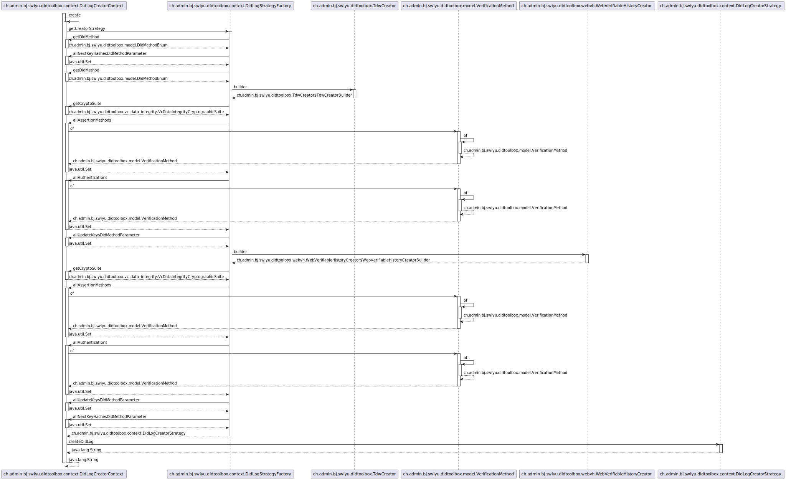
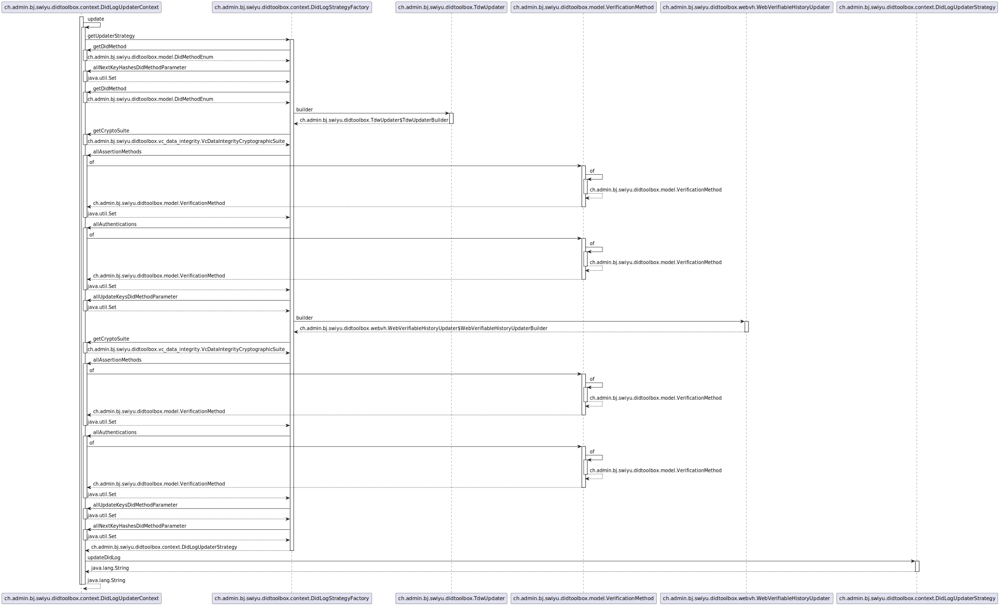
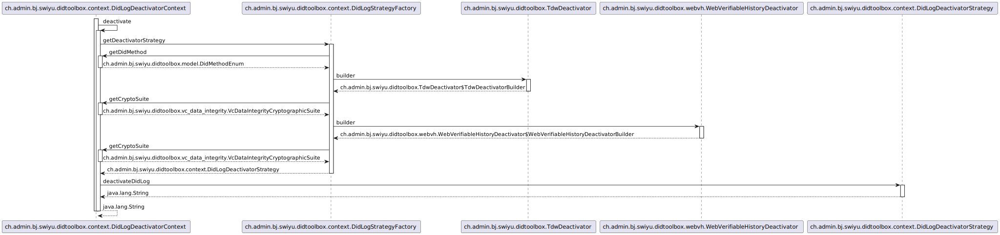

# PlantUML diagrams

## Class diagrams

### Big picture

### Detailed

## Sequence diagrams

### [DidLogCreatorContext#create](../java/ch/admin/bj/swiyu/didtoolbox/context/DidLogCreatorContext.java) method

### [DidLogUpdaterContext#update](../java/ch/admin/bj/swiyu/didtoolbox/context/DidLogUpdaterContext.java) method

### [DidLogDeactivatorContext#deactivate](../java/ch/admin/bj/swiyu/didtoolbox/context/DidLogDeactivatorContext.java) method

